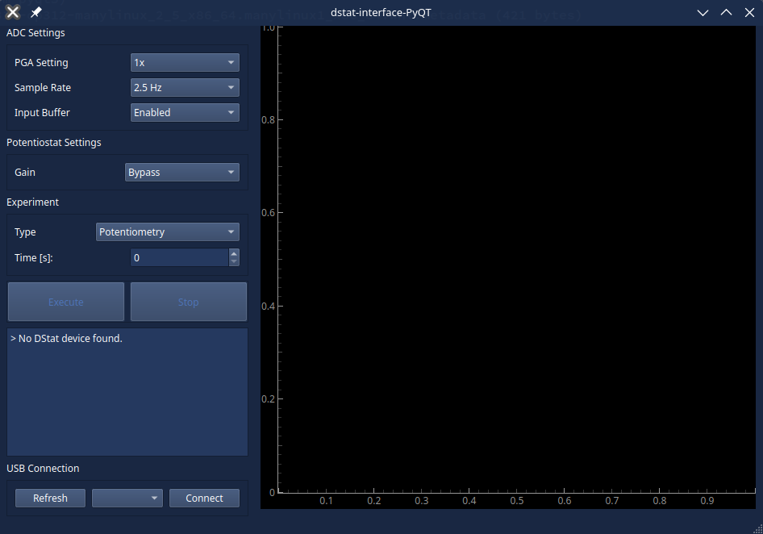
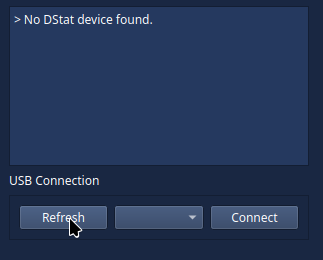
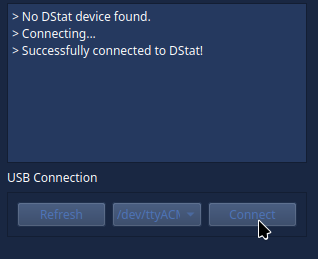
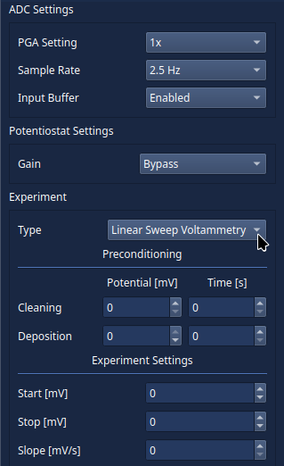
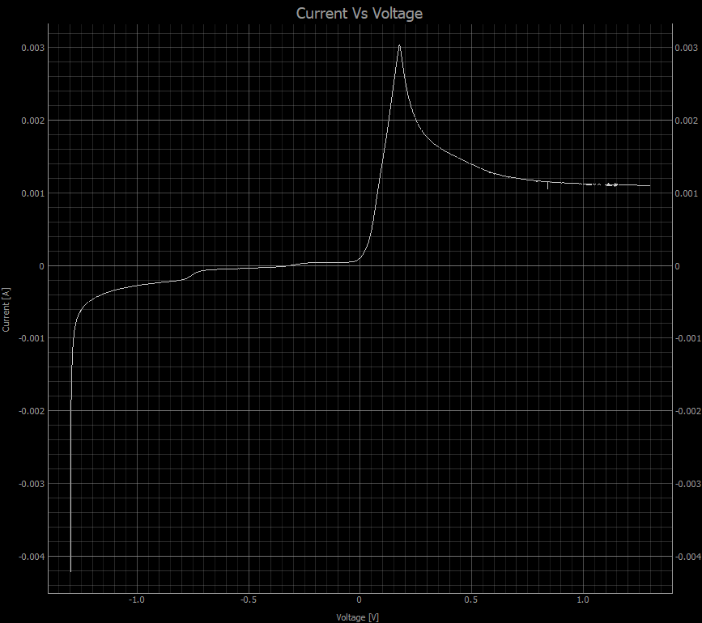

# About The the Project
This repository contains a from scratch PyQT implemenation of [Wheeler Lab's](https://microfluidics.utoronto.ca/) DStat potentiostat interface program. From the [original DStat repository](https://microfluidics.utoronto.ca/gitlab/dstat/dstat-documentation/-/wikis/home):
> The Wheeler Lab DStat is a compact open source/open hardware potentiostat designed for high performance and ease of use in the lab, specializing in sensors and other low current applications, while being inexpensive and easy to integrate into other instruments. The DStat's hardware features a powerful Atmel XMEGA microcontroller, high resolution data converters, low noise/bias current amplifiers, and a single USB connection providing both power and data.

While the DStat project is complete from a hardware, software and documentation perspective, the original software interface was written for Python 2.7 using GTK which is now end of life. This made it difficult to install, especially on Linux. To remedy this, a new interface was created using Python 3 and PyQT for its improved cross platform support. Currently, this interface only supports linear sweep voltammetry (LSV) and potentiometry (untested), however the program was structured using `match` statements based on the experiment type to make adding support more of the functions of the original DStat interface program easy.

# Installation
Pre-built versions are available for Linux and Windows in the [releases tab](https://github.com/jjderooy/dstat-interface-PyQT/releases). If you would like to install manually, follow the instructions below. You will need a working python install.

## Linux
First, navigate the the folder you would like to install to, open a terminal there and clone the repository:
```
git clone https://github.com/jjderooy/dstat-interface-PyQT.git
```

Next, enter that directory and create a virtual environment there:
```
cd dstat-interface-PyQT
python -m venv .venv/
```
Activate the venv:
```
source .venv/bin/activate
```

Install the required libraries using pip:
```
pip install -r requirements.txt
```

From now on, to use the interface with DStat, open a terminal in `\src` and run:
```
source ../.venv/bin/activate
python main.py
```

## Windows
First, navigate the the folder you would like to install to, open powershell there and clone the repository. Alternatively if you don't have git installed, download using the *<> Code* dropdown menu and select *Download ZIP*.

```
git clone https://github.com/jjderooy/dstat-interface-PyQT.git
```
Next, enter that directory and create a virtual environment in a directory called `.venv` there. You will need the *virtualenv* package if not installed already: `pip install virtualenv`.
```
cd dstat-interface-PyQT
python -m venv .venv
```

Activate the venv:
```
.venv\Scripts\activate
```

Install the required libraries using pip:
```
pip install -r requirements.txt
```

From now on, to use the interface with DStat, open a terminal in `\src` and run:
```
..\.venv\Scripts\activate
python main.py
```

# Usage
Upon starting the interface, the following window should appear. Your window may look different depending on your operating system.



### Connection
If the DStat was already connected, it should be available in the dropdown menu at the *USB Connection* section of the interface. If not, connect the DStat and click *Refresh*, select the port, then *Connect*. The message box will indicate if the connection is successful or not.

 

### Starting an Experiment 
To start an experiment, select one from the dropdown menu. Different options are available for different experiment types. You will also need to configure the programmable gain amplifier (PGA), sample rate, input buffer, and transimpedance amplifier gain settings. Tooltips with recommendations are available for many options by hovering the mouse over a given button/dropdown.



*Note: More information about the full functionality is available in the original DStat interface repository. Most of the functionality is not implemented in this interface, and has no plans for implementation. Fortunately the code is structured to make adding additional experiments easy.*

With the DStat connected and the experiment settings configured, click the *Exececute* button to send the experiment to the DStat. The message box will display any messages/data received from the DStat, and the graph will automatically plot this data. For example, a linear sweep voltammetry experiment from -1300mV to 1300mV at a rate of 10mV/s was conducted using a copper working electrode, graphite counter electrode, and silver/silver chloride reference electrode to produce the following plot:



### Saving Data
Clicking the *Stop* button at any point after an experiment has been started will automatically save a `.csv` file named with the current time and type of experiment. This file will contain a header of the data columns and their units. There is no option to choose a save location so files are automatically saved in the same location as the interface program. The graph window has options to export the current plot as a png/svg among other things by right clicking anywhere on the graph.

# Additional Notes
Contributions are welcome! DStat supports so much more than is currently implemented in this interface program. New options can be added to the interface using the `json_maker.py` program to generate a new `dstat_options.json`. Currently, all options supported by the firmware have been added except calibration, chronoamperometry, cyclic voltammetry and square wave voltammetry. These can be added to `dstat_options.json` and implemented in `main.py` by adding new `case`s to the `match` statements.

Tested with [dstat firmware #175 1.2.3](https://microfluidics.utoronto.ca/gitlab/dstat/dstat-firmware/-/jobs/175)

Thank you to Michael Dryden and Wheeler Lab for their excellent open source hardware!